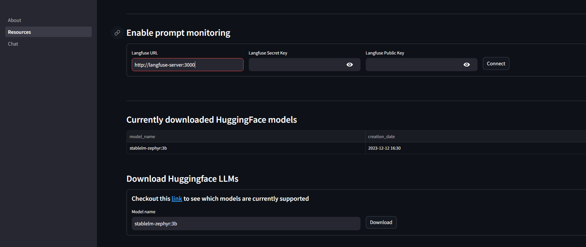
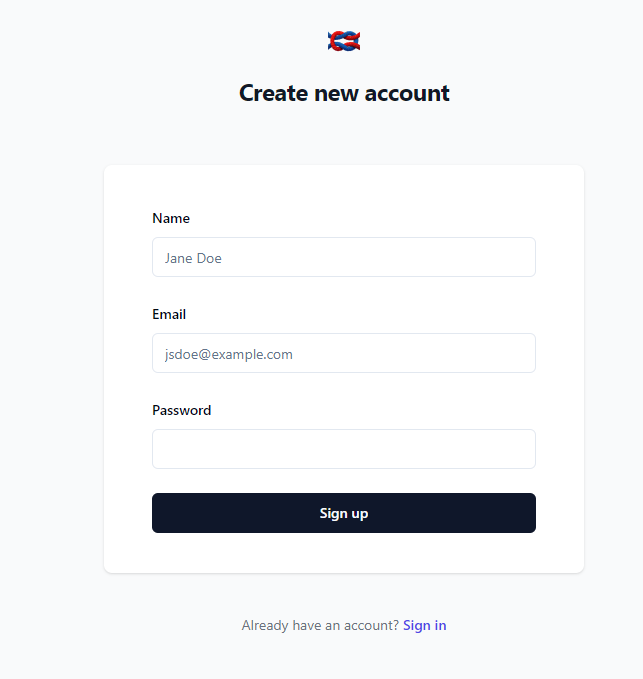

### Deployment options

Docker

- Go to docker dir and then to cpu-only or gpu and run `docker compose up -d`

Kubernetes

- Not yet supported (under construction)

 
Just remember to add necessary api keys for example if you want to use OpenAI models, provide OPENAI api key in docker-compose file

 

Usage

1. Check if everything is connected correctly in **`Resources`** tab
    

2. Upload PDF document
    

3. Create new chat
    

4. Start Chatting, in this case using smallest possible llm (zephyr3b)
    

### More advanced configuration

Local LLM models inference is done using [Ollama]('https://ollama.ai/'). So any model listed in [here](https://ollama.ai/library) is supported.

 

#### Adding additional LLMs

Downloading Open Source models is done in a Resources Tab

 

#### Enabling prompt monitoring

Connecting monitoring service (Langfuse server) is done in Resources Tab

By default Langfuse URL will point to url defined as a MONITORING_SERVER_URL, so if you are deploying this app with docker compose, there is no need to change anything here.

You can of cource provide URL pointing to Langfuse cloud as well.

Setting up monitoring server

1. Go to app_url:3000 and create account
    

2. Log in and create new project
    

3. Create a pair of API keys
    

4. Pass those keys into corresponding places in Resources Tab

